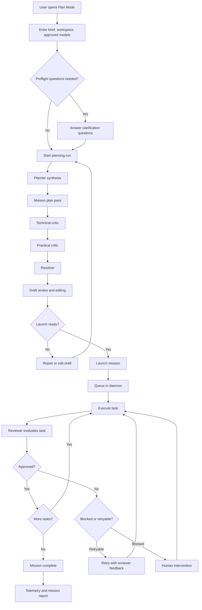

# AgentForce

AgentForce is a mission-control product for engineering teams that want to delegate scoped software work to AI systems without losing structure, review, or operational control.

It turns a product or engineering goal into a planned mission, breaks that mission into explicit tasks, runs those tasks through agent workers, enforces review gates, and keeps humans in control when work stalls, fails, or needs judgment.

## Product Overview

### Problem

Software teams can get useful output from coding agents, but they still struggle to ship larger goals safely:

- A high-level request does not automatically become a usable execution plan.
- AI output is hard to review when task boundaries and success criteria are vague.
- Long-running work needs retries, status visibility, and recovery when something breaks.
- Teams need human intervention points without giving up the speed of autonomous execution.
- Cost, token usage, and quality signals are usually spread across disconnected tools.

### Product Promise

AgentForce gives engineering leads a structured way to plan, launch, supervise, and recover AI-driven software execution from one system.

## Main Goal

Help engineering leads convert scoped software initiatives into reviewable, executable missions that can run with autonomy but not without control.

## Public MVP Product Requirements

The public MVP is the planning-and-execution core of AgentForce. It should be presented as a working product surface, not a future roadmap.

### Core Capabilities

#### 1. Mission Planning in Flight Director

- [X] A user can create a mission from a natural-language brief in Plan Mode.
- [x] The user can select one or more workspace paths before planning begins.
- [x] The user can choose approved models and planning profiles before the first run.
- [x] The system can generate an initial mission draft from the brief.
- [x] The draft can be refined through a conversational planning workflow.

#### 2. Preflight Clarification Before First Plan Run

- [x] The system can pause planning to ask structured clarification questions when the brief is incomplete or ambiguous.
- [x] The user can answer or explicitly skip preflight questions.
- [x] Planning does not proceed until the preflight gate is resolved.

#### 3. Structured Multi-Step Planning Pipeline

- [x] The planning workflow includes planner synthesis, mission plan pass, technical critic, practical critic, and resolver stages.
- [ ] The user can see planning progress by stage instead of only a generic loading state.
- [x] The system can produce a reviewed draft version that is ready for inspection before launch.

#### 4. Draft Inspection and Editing

- [x] The user can edit the mission name, mission goal, and definition of done.
- [x] The user can edit task titles, descriptions, acceptance criteria, dependencies, and output artifacts.
- [x] The user can configure execution defaults and per-task execution overrides where supported.
- [x] The user can correct or refine the draft before launch instead of accepting planner output as-is.

#### 5. Launch Readiness and Mission Launch

- [x] The system validates whether the draft is ready to launch.
- [x] Launch blockers are surfaced clearly before a mission starts.
- [x] A reviewed draft can be launched directly from Plan Mode.
- [x] Launching a mission places it into a persistent execution queue.

#### 6. Mission Execution and Control

- [x] Missions execute through a persistent daemon-backed workflow.
- [x] Users can see a mission list with current status, cost, and progress signals.
- [x] Users can open a mission detail view to inspect task status, event history, and execution defaults.
- [x] Users can stop, restart, archive, delete, or readjust a mission from the product.

#### 7. Task-Level Visibility and Review Gates

- [x] Users can inspect each task individually.
- [x] Users can view live or recent task output.
- [x] Every completed task goes through a review step.
- [x] Review results expose score, feedback, and blocking issues when available.
- [x] Tasks that do not pass review can retry with reviewer feedback.

#### 8. Human Intervention and Recovery

- [ ] The system can escalate blocked or exhausted work for human intervention.
- [ ] A user can inject guidance into an in-progress task.
- [x] A user can resolve blocked work, retry tasks, or mark blocked work as failed when needed.
- [x] A user can change task execution settings when a task needs a different model profile.
- [x] A user can move a mission back into planning through a readjustment flow when the current trajectory is wrong.

#### 9. Telemetry and Accountability

- [x] The product surfaces mission and task counts across runs.
- [x] The product tracks token usage and cost.
- [x] The product exposes retry distribution and cumulative cost views.
- [x] Telemetry can be inspected from the UI and exported for analysis.

### Supporting but Secondary Surfaces

These surfaces are part of the shipped product, but they are not the hero story of the public MVP:

- [x] Model and provider configuration
- [x] Ground Control and daemon health visibility
- [x] Default settings and execution caps

## Personas

### 1. Engineering Lead Elena

**Role**  
Engineering manager or tech lead responsible for turning a scoped initiative into delivered software.

**Goals**

- Turn ambiguous goals into execution-ready plans.
- Delegate work to AI systems without losing delivery control.
- Review mission readiness before launch.
- Track progress, quality, and intervention points across a mission.

**Pain Points**

- Planning usually happens in chat while execution happens elsewhere.
- It is difficult to tell whether an AI-generated plan is safe to launch.
- Review, retries, and recovery are fragmented across tools and terminals.
- Delivery risk grows when no one can see what is happening mid-run.

**Success With AgentForce**

- Elena can go from brief to launched mission in one workflow.
- She can see what the system is doing now, what is blocked, and what needs a decision.
- She can trust that work is reviewed before it counts as done.

### 2. Staff Engineer Marcus

**Role**  
Senior or staff engineer responsible for technical quality, implementation correctness, and unblocking delivery.

**Goals**

- Inspect task-level output and review feedback quickly.
- Intervene when the system is stuck, wrong, or under-specified.
- Adjust task execution when a stronger or more suitable model is needed.
- Keep acceptance criteria and outputs concrete enough for reliable execution.

**Pain Points**

- Agent runs are often opaque once they leave the prompt window.
- Review feedback is inconsistent or disconnected from the actual task trace.
- Recovering from a bad run usually means restarting manually with lost context.
- Model changes and retries are tedious when buried in low-level tooling.

**Success With AgentForce**

- Marcus can diagnose a task from one place.
- He can see output, review findings, retry history, and task controls together.
- He can recover a mission without rebuilding the whole process by hand.

### 3. AI Platform Operator Priya

**Role**  
Operator or platform owner responsible for keeping the execution environment reliable, configurable, and visible.

**Goals**

- Keep available models and providers aligned with what the team is allowed to use.
- Monitor queue health and in-flight execution.
- Set reasonable defaults and caps for mission behavior.
- Provide a stable execution platform without becoming the bottleneck for every run.

**Pain Points**

- Provider and model configuration often drifts from what users think is available.
- Queue health and worker activity are hard to inspect in real time.
- Failures in the execution layer can silently undermine confidence in the product.
- Teams need governance without losing usability.

**Success With AgentForce**

- Priya can maintain the execution layer from within the product.
- She can see queue state, active work, and system-level telemetry.
- She can support the product operationally without owning every individual mission.

## Core User Journey

## MVP Acceptance Criteria

- A user can move from brief to launched mission entirely inside the product workflow.
- Planning can be gated by explicit clarification questions when the brief is incomplete.
- The product shows a staged planning flow instead of hiding planning behind a single generic action.
- A user can inspect and edit the mission draft before launch.
- A launched mission enters a persistent execution path instead of requiring a one-off manual run.
- Each completed task goes through a review decision before it is treated as done.
- Retry loops and human intervention paths are available when execution does not pass review or gets blocked.
- Mission-level and task-level visibility are available while work is running.
- Token, cost, and retry telemetry are available during or after mission execution.

## Non-Goals for the Public MVP Document

- No roadmap section
- No speculative post-MVP features
- No Black Hole workflow in the public MVP narrative
- No deep internal architecture or implementation detail dump
