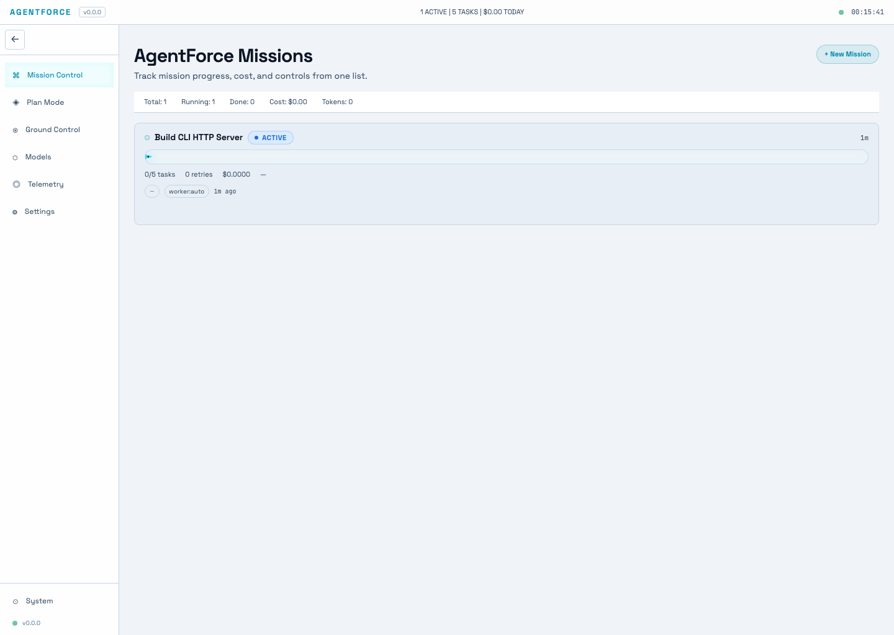
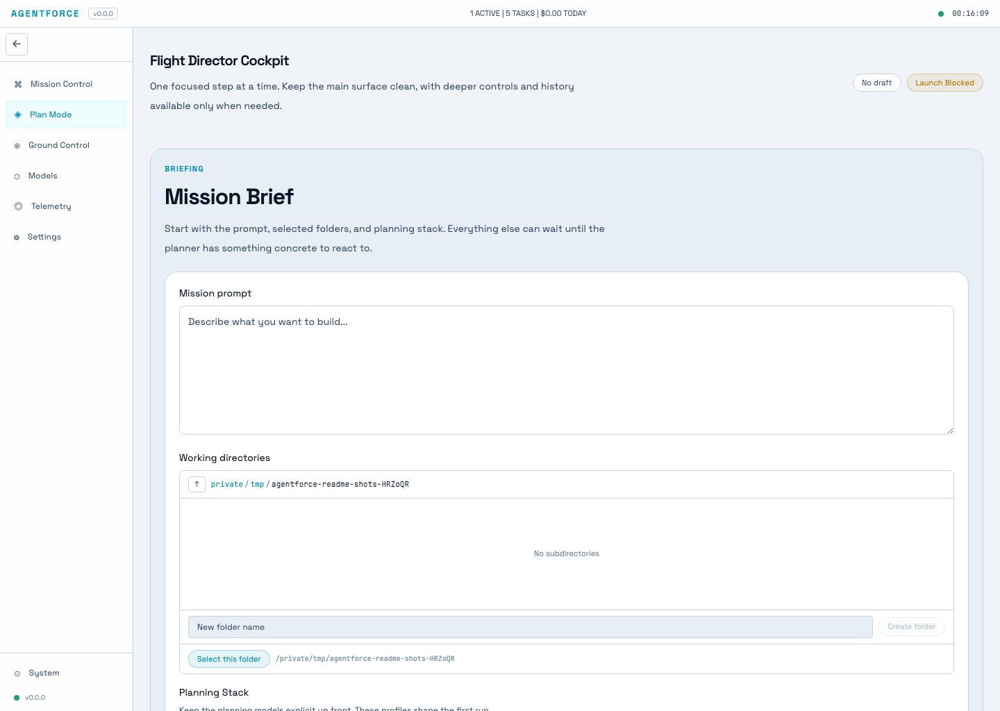
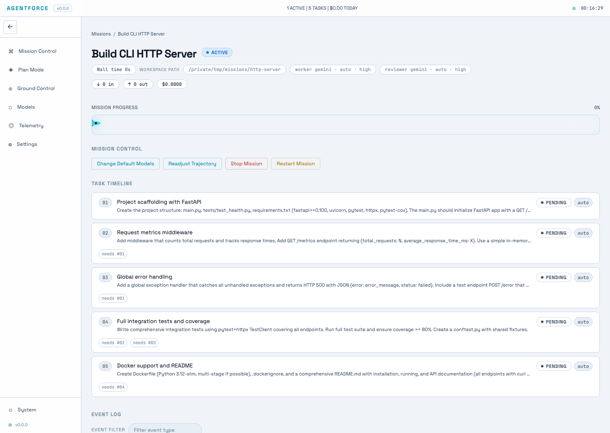

# AgentForce

Plan, launch, and supervise AI coding missions with review gates, retries, and live visibility.

AgentForce is a mission-control system for engineering teams that want AI agents to do scoped software work without losing structure or operational control. It turns a product or engineering brief into a mission draft, validates launch readiness, queues execution through a persistent daemon, and keeps humans in control when work stalls, fails, or needs judgment.

## Why AgentForce

Most AI coding workflows break down at the same points:

- planning happens in one tool and execution in another
- vague task boundaries make output hard to review
- long-running work needs retries, status visibility, and recovery paths
- teams need human intervention points without giving up autonomy
- cost, token usage, and quality signals are hard to inspect in one place

AgentForce brings those pieces together in a single product flow.

## What Ships Today

| Surface | What you do there | Why it matters |
| --- | --- | --- |
| Flight Director | Turn a brief into a launchable mission draft | Planning stays connected to execution |
| Launch readiness | See blockers before a mission starts | Bad specs fail early, not mid-run |
| Mission Control | Queue, stop, restart, archive, and readjust missions | Missions stay operable after launch |
| Task review gates | Review completed tasks before they count as done | Output quality is explicit, not implied |
| Telemetry | Inspect mission counts, cost, token usage, and retries | You get accountability across runs |
| CLI + dashboard | Use the browser for flow, CLI for automation | Easy to start, scriptable when needed |

## 2-Minute Quick Start

### 1. Install

```bash
curl -fsSL https://raw.githubusercontent.com/eduardokanema/agentforce/main/scripts/install.sh | bash
```

The installer downloads the full source tree, builds the dashboard locally when prebuilt assets are not bundled, installs the package, and verifies that the local dashboard starts successfully.

### 2. Start the dashboard

```bash
mission serve --daemon
```

If port `8080` is already in use:

```bash
mission serve --daemon --port 8091
```

### 3. Open AgentForce

Open `http://localhost:8080` in your browser, or the port you selected.

### 4. Launch your first mission

1. Open **Flight Director**
2. Describe what you want to build
3. Review the generated mission draft
4. Launch when the plan is ready

You can explore the dashboard and planning flow immediately after install. To actually execute mission work, configure at least one available execution path in the product. The current shipped surfaces expose Codex CLI, Claude Code, Gemini CLI, OpenCode, OpenRouter, and Ollama depending on what is installed and configured locally.

## Local Development Setup

If you want to work from a local checkout instead of the installer:

```bash
git clone https://github.com/eduardokanema/agentforce.git
cd agentforce
cd ui
npm ci
npm run build
cd ..
python3 -m pip install -e .
mission serve --daemon
```

If you prefer Bun:

```bash
cd ui
bun install --frozen-lockfile
bun run build
cd ..
```

For development dependencies:

```bash
python3 -m pip install -e ".[dev]"
pytest -q
```

## How It Works

1. **Start from a brief**  
   In Flight Director, describe the goal, choose workspace paths, and pick approved models or planning profiles.

2. **Clarify before planning**  
   If the brief is incomplete, AgentForce can stop and ask structured preflight questions before the first plan run.

3. **Review the draft mission**  
   The system produces a draft with mission goal, definition of done, task list, dependencies, artifacts, and execution defaults.

4. **Launch into a persistent queue**  
   A launch-ready mission is queued through the embedded daemon instead of depending on a one-off terminal run.

5. **Execute with review gates**  
   Tasks run through worker agents, completed work is reviewed, failed reviews can retry with feedback, and blocked work can be escalated.

6. **Intervene when needed**  
   Operators can inspect status, change task execution settings, retry work, resolve blocked tasks, or move a mission back into planning.

7. **Inspect telemetry and history**  
   Mission-level and task-level views expose progress, retries, cost, tokens, and review outcomes across runs.

## Screenshots

### Mission Control

The dashboard shows current missions, progress, and status at a glance.



### Flight Director

Flight Director is the planning surface where a brief becomes an execution-ready mission.



### Mission Detail

Mission detail keeps task status, review flow, and execution defaults in one place.



## Who It Is For

- **Engineering leads** who want AI-assisted delivery without giving up review and launch control
- **Staff engineers** who need to inspect task output, intervene quickly, and keep specs concrete
- **AI or platform operators** who need to manage models, queue health, defaults, and reliability

## Documentation

- [ABOUT.md](ABOUT.md) — product overview, personas, and the end-to-end workflow
- [`missions/`](missions/) — real mission spec examples
- [`ui/README.md`](ui/README.md) — frontend development notes

## Technical Reference

<details>
<summary>CLI quick reference</summary>

```bash
mission serve --daemon              # start the dashboard with the embedded execution daemon
mission start spec.yaml             # create a mission from a YAML spec
mission list                        # list known missions
mission status <mission-id>         # inspect mission progress
mission report <mission-id>         # print a detailed mission report
mission pause <mission-id>          # pause a running mission
mission resume <mission-id>         # resume a paused mission
mission kill <mission-id>           # stop a mission
mission resolve <mission-id> <task-id> "message"
mission fail <mission-id> <task-id>
mission review <mission-id>
mission metrics [--mission <id>]
```

</details>

<details>
<summary>Minimal mission spec example</summary>

```yaml
mission:
  name: "Build HTTP API Server"
  goal: "Create a FastAPI service with health checks and metrics"
  definition_of_done:
    - "GET /health returns HTTP 200 with JSON status"
    - "GET /metrics returns HTTP 200 with request counts"
    - "pytest tests/ passes"
  caps:
    max_concurrent_workers: 2
    max_retries_per_task: 3
    max_retries_global: 10
    max_wall_time_minutes: 120
    max_cost_usd: 2.00
    review: enabled
  execution_defaults:
    worker:
      agent: codex
      model: gpt-5.4
      thinking: medium
    reviewer:
      agent: claude
      model: claude-sonnet-4-6
      thinking: low

tasks:
  - id: "01"
    title: "Project scaffolding"
    description: "Create the service skeleton and /health endpoint"
    acceptance_criteria:
      - "GET /health returns HTTP 200 with {'status': 'ok'}"
      - "pytest tests/test_health.py -v passes"
    output_artifacts:
      - "app/main.py"
      - "tests/test_health.py"
```

</details>

<details>
<summary>Daemon endpoints</summary>

| Endpoint | Method | Description |
| --- | --- | --- |
| `/api/daemon/status` | `GET` | Daemon state, queue, active missions, heartbeat |
| `/api/daemon/enqueue` | `POST` | Queue a mission by `mission_id` |
| `/api/daemon/dequeue` | `POST` | Remove a pending mission from the queue |
| `/api/daemon/stop` | `POST` | Drain in-flight work and stop accepting new jobs |

</details>

## Requirements

- Python 3.11+
- A modern browser for the dashboard
- Node 18+ with npm, or Bun, when building from a source checkout without bundled `ui/dist`
- At least one supported execution path configured locally if you want to run missions end to end

## License

MIT
