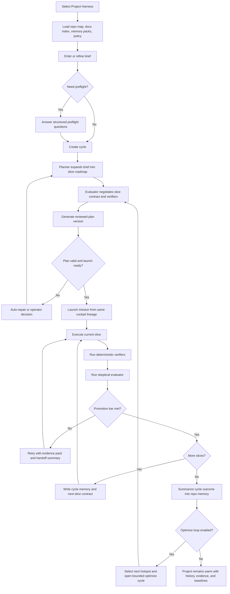

# AgentForce Harness Redesign

Date: 2026-04-14
Status: Research and product design
Scope: Redesign direction only. No migration plan. No implementation task breakdown.

## Executive Summary

AgentForce already has many strong harness primitives:

- durable draft, plan-run, plan-version, mission, and black-hole campaign state
- backend-owned launch readiness and planning/repair gates
- structured planner, critic, resolver, reviewer, and retry flows
- live streams, task history, telemetry, and repo-aware filesystem controls

What it does not yet have is one simple, repo-scoped harness model that unifies:

- long-lived context and memory
- planning and execution lineage
- validation and evidence
- operator visibility and intervention
- entropy control over long-running projects

This redesign turns AgentForce from a mission-control app into a harness-native frontier development system for long-running software projects.

Core move:

- make the repository the system of record
- make validation evidence first-class
- make the operator see one continuous lineage from brief to plan to run to repair to improvement
- keep backend truth canonical
- keep the UI simpler by centering on `Now`, `Next`, `Evidence`, and `History`

## Research Synthesis

### OpenAI harness-engineering lessons applied here

Derived from OpenAI's field report on Codex and agent-first product development:

- humans steer, agents execute
- repository-local knowledge must be the system of record
- agent legibility matters more than human-only elegance
- observability, browser validation, and local tooling must be agent-accessible
- architecture and taste need mechanical enforcement
- entropy requires continuous garbage collection, not periodic heroics

Design implication for AgentForce:

- the product should stop treating docs, plans, evals, and telemetry as side outputs
- it should treat them as the primary control plane for both humans and agents

### Anthropic harness-design lessons applied here

Derived from Anthropic's long-running harness work:

- planner, generator, evaluator separation produces stronger long-running outcomes
- external skeptical evaluation is more reliable than self-evaluation
- structured handoff artifacts are critical when work spans long time windows
- sprint or slice contracts reduce ambiguity before code generation
- compaction helps, but clean resets plus strong handoff artifacts are still important
- harness complexity should be reduced whenever model capability makes it unnecessary

Design implication for AgentForce:

- every slice of work needs an explicit contract and verifier
- evaluator logic should be a first-class subsystem, not scattered across planning, review, and black-hole logic
- memory should be structured around handoff quality, not raw accumulation

### Open-source harness patterns worth adopting

From the curated harness-engineering ecosystem:

- `AGENTS.md` as a short table of contents, not an encyclopedia
- spec-driven development artifacts like `spec-kit`
- context/memory discipline from OpenHands and related context-engineering work
- trace grading and agent eval patterns from OpenAI eval guidance
- 12-factor-style agent runtime discipline for pause, resume, state ownership, and validation

Design implication for AgentForce:

- formalize repo-local docs and contracts
- formalize trace/evidence retention and grading
- formalize pause/resume and verification ownership

## Current Product Diagnosis

### What is already working

AgentForce already has a solid execution kernel:

- `MissionDraft`, `PlanRun`, `PlanVersion`, `MissionState`, and black-hole stores are durable
- planning already uses a clear staged pipeline:
  - `planner_synthesis`
  - `mission_plan_pass`
  - `technical_critic`
  - `practical_critic`
  - `resolver`
- launch readiness is backend-owned
- repair and preflight gating already exist
- support activity and stream events are already structured
- mission retry/review/human intervention loops already exist
- task and mission telemetry already exists

### Main design problems

The problem is not missing power. The problem is fragmented power.

Today the operator crosses too many conceptual surfaces:

- plan draft
- planning run history
- mission detail
- task detail
- telemetry
- black-hole campaign
- settings

This creates five important gaps:

1. Long-lived project memory is too weak.
   Current memory is useful but primitive. It is mostly mission-scoped JSON memory, not repo-scoped working knowledge with strong retrieval and summarization.

2. Validation is not a first-class product object.
   Checks, review, telemetry, and repair exist, but they are not unified into one evidence model.

3. Lineage breaks at launch.
   Planning has rich context. Execution has rich context. The handoff is visible, but not central.

4. Repo-local system-of-record is incomplete.
   The repo has strong code and tests, but weak docs structure as a maintained harness knowledge base.

5. Black Hole is too separate.
   It is powerful, but it feels like a special mode rather than one optimization loop inside the same harness model.

## Redesign Thesis

### Product Thesis

AgentForce should become a `Project Harness` for one long-running software codebase.

The operator should manage one durable project context, inside which multiple planning and execution cycles happen.

Keep current engine concepts. Change the product framing.

### New Root Object: Project Harness

A `Project Harness` is the durable container for:

- repo identity and workspace roots
- repo-local docs and maps
- execution policy and approved models
- long-term memory and decisions
- open plan cycles
- active missions
- evidence and verification history
- optimization loops such as Black Hole

This means:

- `MissionDraft` becomes a cycle artifact inside a project
- `MissionState` stays the execution kernel
- `PlanRun` and `PlanVersion` stay the planning kernel
- `Black Hole` becomes an optimization mode inside the same project cockpit

### Mapping To Current Architecture

To keep this redesign executable against the current repo, the new model maps to existing records first.

#### Project Harness V1

V1 should be a derived backend view, not a brand-new persisted root record.

Canonical key:

- repo root or configured primary workspace root

Derived from current records:

- drafts from `PlanDraftStore`
- plan runs and versions from `PlanRunStore`
- missions from `MissionState` files and mission routes
- optimization state from `BlackHoleCampaignStore`
- telemetry from `TelemetryStore`
- repo memory from the memory subsystem, re-keyed by repo identity

Why derived-first:

- preserves current storage model
- avoids premature migration complexity
- lets the product become coherent before the persistence layer changes

#### Cycle V1

V1 cycle should map to one draft lineage.

Definition:

- one initial brief
- one draft id
- zero or more plan runs
- zero or more reviewed versions
- zero or one launched mission
- zero or more repair/follow-up branches
- terminal outcome or handoff to a later cycle

Readjustment rule:

- if the user reopens planning from a launched mission, create a linked successor cycle
- do not overload one cycle with many unrelated replans

#### Compatibility Note

MVP preserves current backend contracts:

- `simple_plan` and `black_hole` draft kinds remain valid
- preflight and repair state continue to live in draft validation payloads
- `launch_status` remains backend-owned and canonical

The redesign changes presentation and orchestration framing first, not the core route contract.

## Design Principles

1. Backend truth stays canonical.
   The frontend must consume backend launch state, run state, repair state, and evidence state. No local heuristics for readiness.

2. One lineage, not many pages.
   The operator should always see:
   - what was asked
   - what was planned
   - what is running
   - what was verified
   - what blocked
   - what changed next

3. Evidence before opinion.
   Every important state change should point to evidence:
   - verifier result
   - stream trace
   - artifact diff
   - screenshot
   - metric delta
   - reviewer finding

4. Memory must be useful, not just durable.
   Memory should be repo-scoped, retrieval-aware, and summarized into handoff artifacts.

5. Simplicity wins.
   Use the simplest harness that preserves lift.
   If a control loop stops adding clear value, collapse it.

6. Entropy is a product concern.
   Old plans, stale rules, and noisy histories must be compacted, graded, or retired.

## Target Product Model

### Core Domain Objects

#### 1. Project

Long-lived repo-scoped harness record.

Owns:

- repo root and allowed paths
- docs map and graph map
- execution policies
- memory summaries
- current quality baseline
- active and historical cycles

#### 2. Cycle

One planning-to-execution attempt.

Contains:

- brief
- plan runs
- reviewed plan version
- launched mission
- follow-ups
- repair loops
- final outcome summary

#### 3. Slice

Smallest verified unit of progress.

A slice may be:

- a mission task
- a planning follow-up
- a black-hole candidate mission
- a repair action

Every slice has:

- contract
- owner phase
- verifier set
- artifacts
- evidence pack

#### 4. Evidence Pack

First-class validation record.

Contains:

- commands run
- exit codes
- logs and stream events
- screenshots
- generated artifacts
- test results
- metrics and deltas
- evaluator findings
- operator annotations

Evidence Pack V1 should be a normalized view over current artifacts before it becomes a new persistence format everywhere.

#### 5. Memory Pack

Structured context object, not raw transcript dump.

Layers:

- repo memory
- cycle memory
- slice memory
- operator decisions
- quality baselines
- known failures and recoveries

### What Stays From Current Architecture

Keep and elevate:

- `MissionState` and daemon-backed execution
- `PlanRun` and `PlanVersion`
- staged planning flow from `planFlow.ts`
- backend `launch_status`
- support activity stream rendering
- execution profile controls
- `FileBrowser` and backend filesystem guardrails
- retry, repair, preflight, and human intervention semantics

### Explicit Mapping Of Current Mechanisms To Future Verifiers

- plan validation -> contract/schema verifier
- reviewer score and blocking issues -> evaluator verifier
- black-hole analyzer and metric delta -> metric threshold verifier
- task test commands and repo commands -> command verifier
- task output artifacts and changed files -> artifact verifier
- UI stream traces and screenshots -> UI journey verifier when available

## Target Information Architecture

### Main Surfaces

The redesign should collapse current UI sprawl into three primary surfaces.

#### 1. Projects

Replaces split draft list plus mission list thinking.

Shows:

- active projects
- current state
- current blocker
- next safe action
- active model/profile
- latest evidence status
- cost and retry summary

Primary question answered:

- `Which project needs me now?`

#### 2. Project Cockpit

One unified page for plan, run, optimize, and repair.

Layout:

- left rail: lineage and state
- center: `Now` and `Next`
- right rail: evidence

Tabs or sections:

- `Now`
- `Plan`
- `Run`
- `Evidence`
- `History`
- `Optimize`

Primary question answered:

- `What is happening now, why, and what can I safely do next?`

#### 3. Settings and Catalog

For:

- models
- providers
- policies
- default roots
- labs and runtime toggles
- verifier catalog
- docs health

Primary question answered:

- `What are the rules of this harness?`

## Project Cockpit Design

### Default State: Now / Next / Evidence

The default cockpit view should not open on transcript or forms.
It should open on operational truth.

#### Now

Always visible:

- current phase
- current slice
- current blocker
- current budget state
- current evaluator/verifier state
- active profile

#### Next

Always visible:

- next safe system action
- next needed operator action
- why that action is next

#### Evidence

Always one click away, preferably one panel away:

- stream trace
- screenshots
- validator results
- changed files
- scorecards
- metric deltas

### Planning Experience

Retain stage-first planning.
Do not revert to dense all-at-once editing.

Improve it with:

- explicit sprint or slice contract panel before generation
- explicit verifier preview before launch
- clearer separation between `advisory`, `blocking`, and `needs human judgment`
- durable handoff summary generated after every major stage

### Execution Experience

Merge mission detail into the cockpit lineage.

Instead of leaving Plan Mode and entering Mission Detail as a new conceptual space:

- keep the same lineage strip
- shift the center panel from planning state to execution state
- keep the same evidence drawer

### Optimize Experience

Black Hole becomes `Optimize`.

Same evidence model. Same lineage. Same operator rules.

It should feel like:

- a bounded optimizer loop inside the project harness

not:

- a separate product inside the product

### Simplification Policy

This redesign only works if it removes conceptual surfaces.

Collapsed or demoted in MVP:

- `MissionDetailPage` becomes execution state inside `Project Cockpit`
- `BlackHoleModePage` becomes `Optimize` inside `Project Cockpit`
- standalone task detail becomes an evidence drilldown, not a primary navigation destination
- aggregate telemetry becomes a secondary fleet/history view, not the main place to understand active work
- transcript and logbook stay available, but stop being the default center of gravity

Preserved as shared primitives:

- support drawer and support activity rendering
- execution profile selectors
- file browser and settings-backed root selection
- staged planning rail and substep tracker

## Repo-Local System of Record

### Required Documentation Layout

Adopt a harness-oriented repo structure:

```text
AGENTS.md
ARCHITECTURE.md
docs/
  index.md
  product/
  contracts/
  workflows/
  quality/
  decisions/
  runbooks/
  status/
  generated/
plans/
  active/
  completed/
specs/
graphify-out/
```

### Documentation Roles

- `AGENTS.md`
  Short table of contents and operating rules.

- `docs/contracts/`
  Canonical payload and state contracts.

- `docs/workflows/`
  Human and agent loops.

- `docs/quality/`
  Quality score, verifier catalog, baseline metrics, known gaps.

- `docs/status/`
  Planned vs implemented vs deprecated.

- `graphify-out/`
  Live structural map and repo knowledge graph.

### Why This Matters

This is not a docs cleanup project.
It is the harness memory substrate.

If knowledge is not repo-local, versioned, and linked to validation, it does not reliably exist for agents.

## Memory Redesign

### Current Weakness

Current memory is durable but too flat:

- global
- project
- task

This is not enough for long-running frontier development.

### Target Memory Layers

#### Repo Memory

Long-lived and retrievable:

- architectural decisions
- coding conventions
- recurring failure signatures
- verifier recipes
- baseline metrics

#### Cycle Memory

Shorter-lived:

- current brief summary
- planning rationale
- rejected directions
- accepted constraints
- unresolved risks

#### Slice Memory

Highly focused:

- current contract
- last failed verifier
- files changed
- immediate next action

#### Operator Memory

Explicit decisions:

- approved tradeoffs
- accepted residual risks
- hand-entered rationales
- exception records

### Memory Rules

- every run produces a compact handoff summary
- every approved fix can write a reusable memory entry
- stale memory must be summarized or pruned
- retrieval should be query-based, not full-dump by default

### MVP Memory Boundary

To keep MVP simple, memory scope is intentionally narrow:

- canonical repo identity
- repo decision log
- cycle handoff summaries
- promoted lessons from approved review outcomes
- operator-entered risk or tradeoff notes

Not required for MVP:

- advanced vector retrieval UI
- broad semantic memory search across all historical artifacts
- automated memory clustering or deduplication beyond simple pruning and summarization

## Verification and Evidence Redesign

### New First-Class Object: Verification Harness

Every slice should declare a verifier set.

Verifier types:

- command verifier
- artifact verifier
- UI journey verifier
- metric threshold verifier
- contract/schema verifier
- evaluator review verifier

### Evidence Capture Policy

To avoid over-instrumentation, evidence capture should be tiered.

#### Required for every slice

- slice contract
- current status and owner phase
- verifier results
- key stream or event summary
- changed artifacts or explicit no-change result

#### Captured when available and cheap

- screenshots
- structured stream events
- metric deltas
- reviewer scorecards

#### On-demand or expensive

- full logs
- full browser replay
- large trace bundles
- verbose command transcripts

Rule:

- product UI should default to compact evidence
- deeper artifacts should be expandable, not eagerly loaded

### Verification Ladder

Order matters.

1. Static and structural checks
2. Deterministic command and artifact checks
3. UI and runtime behavior checks
4. Skeptical evaluator pass
5. Human decision only for ambiguity or tradeoff

### VerificationSpec

Conceptual shape:

```yaml
verification:
  - id: api-smoke
    kind: command
    command: pytest tests/test_api.py -q
    success: exit_code == 0

  - id: ui-critical-path
    kind: ui_journey
    tool: playwright
    success:
      - "user can create draft"
      - "launch button enabled only when launch_status.ready"

  - id: artifact-check
    kind: artifact
    paths:
      - docs/contracts/api.md
      - ui/src/lib/types.ts
    success: "files exist and changed together"
```

### Evidence Pack Requirements

Every failed or promoted slice should preserve:

- what was supposed to happen
- what actually happened
- what evidence proved it
- what changed next

This becomes the base unit for:

- repair
- retry
- audit
- memory writing
- future evals

## Evaluator Redesign

### Current State

AgentForce already has evaluators, but they are fragmented:

- planning critics
- task reviewer
- black-hole analyzer
- validation board

### Target State

Use one evaluator framework with specialized adapters.

Evaluator classes:

- `PlanEvaluator`
- `ExecutionEvaluator`
- `OptimizationEvaluator`
- `QualityDriftEvaluator`

Shared output contract:

- scorecard
- blocking issues
- evidence references
- suggested repair actions
- confidence

### Sprint Or Slice Contract

Before a slice starts, generator and evaluator should agree on:

- exact scope
- exact outputs
- exact verifiers
- exact promotion bar

This keeps the generator from solving the wrong problem well.

## Entropy and Garbage Collection

### Required Product Features

- stale-doc detection
- stale-plan detection
- duplicate-memory compression
- quality score by domain
- recurring cleanup missions
- deprecated-contract warnings

### Product Rule

Entropy control is not maintenance work after launch.
It is a standing harness lane.

## Updated Main Flowchart



## PRD

### Product Name

AgentForce Project Harness

### Product Goal

Help engineering teams run long-lived AI-driven software delivery with:

- high visibility
- explicit planning power
- strong validation
- durable memory
- simple human control

### Users

#### 1. Delivery Lead

Needs:

- turn a goal into a strong plan
- know what is happening now
- intervene only when needed
- trust that progress is real

#### 2. Technical Operator

Needs:

- inspect evidence fast
- reroute or retry slices
- understand failure cause without replaying everything
- compare current state against contract

#### 3. Platform Owner

Needs:

- enforce model and policy boundaries
- keep verifier catalog healthy
- monitor cost, quality drift, and runtime health
- keep repo-local harness knowledge current

### Jobs To Be Done

- when I start a large AI-assisted project, I want one durable project context so I do not lose understanding between runs
- when a slice fails, I want evidence and next action immediately so recovery is cheap
- when a plan is generated, I want its verifier contract visible before launch
- when work is complete, I want memory and docs updated so later runs start stronger
- when the system drifts, I want cleanup to be routine and visible

### Functional Requirements

#### A. Project Harness

- user can create and reopen a project harness by repo path
- project owns repo map, docs health, memory, policies, cycles, missions, and evidence history

#### B. Unified Cockpit

- user can see plan, run, optimize, evidence, and history in one cockpit
- cockpit always shows current state, blocker, next action, and current evidence source

#### C. Slice Contracts

- every slice has explicit outputs and verifiers
- operator can inspect contract before execution

#### D. Verification Harness

- deterministic verifiers run before promotion whenever possible
- evaluator findings reference evidence, not only prose

#### E. Memory Packs

- repo memory persists across cycles
- cycle and slice memory are summarized automatically
- memory entries can be promoted from successful runs and reviews

#### F. Optimization Mode

- hotspot optimization uses same lineage and evidence model as normal planning/execution
- optimize loops remain bounded and operator-visible

#### G. Entropy Control

- system tracks stale docs, stale plans, stale memory, and quality drift
- recurring cleanup can be launched as bounded system work

### Non-Goals

- no migration design in this document
- no distributed multi-node scheduler design
- no full replacement of current `MissionEngine`
- no speculative autonomous product management layer

### Success Metrics

- lower time-to-understand current project state
- fewer launches with missing verifiers
- lower retry count caused by contract ambiguity
- higher first-pass promotion rate on slices
- faster operator recovery from blocked states
- measurable growth in reusable repo memory and docs health

## MVP

### MVP Definition

MVP is not full reinvention.
MVP is the smallest product slice that makes AgentForce feel like one harness instead of many tools.

### MVP Scope

#### 1. Project Harness Shell

- add durable project object
- map current drafts, plan runs, missions, and black-hole campaigns into one project lineage

Implementation note:

- V1 project shell should be a derived aggregate over current records keyed by canonical repo root

#### 2. Unified Cockpit

- merge current Plan Mode and Mission Detail into one project cockpit
- keep stage-first planning
- add persistent `Now`, `Next`, and `Evidence` panels

#### 3. Slice Contract and Verifier Preview

- before plan promotion and before mission launch, show exact verifier set for each slice
- store verifier results in evidence packs

#### 4. Repo Memory V1

- promote current memory to repo-scoped identity
- add handoff summaries and operator decision log

#### 5. Optimize As Integrated Mode

- keep current black-hole engine
- move it under the same cockpit lineage and evidence model

#### 6. Docs System-of-Record V1

- add docs index, contracts, workflows, status, and quality docs
- treat them as repo-owned harness knowledge

### MVP Acceptance Criteria

- a user can open one project and stay in one cockpit from brief through run
- a user can see current blocker and next action without opening a modal
- every launched slice has at least one explicit verifier
- every failed slice shows an evidence pack with concrete failure reason
- repo memory persists across cycles for the same project
- optimize mode uses the same evidence and lineage model
- docs status makes planned vs implemented vs stale visible

Additional MVP acceptance rules:

- cycle identity is unambiguous from draft lineage
- readjustment creates an explicit linked successor cycle
- project cockpit can explain any active blocker using backend-owned state plus an evidence reference

### MVP Out Of Scope

- automated doc gardening agents
- advanced semantic/vector retrieval UI
- multi-project portfolio planning
- distributed execution runtime

## Open-Source and Modern Building Blocks

Recommended building blocks:

- `AGENTS.md` format for short repo-local agent entrypoints
- `graphify` for repo map and architectural communities
- `spec-kit` style explicit specs and execution plans
- Playwright for UI verifiers and evaluator browsing
- OpenTelemetry-compatible traces, logs, and metrics
- JSONL trace and stream storage for replay and grading
- deterministic eval and trace grading patterns from OpenAI eval guidance

## Key Product Tradeoffs

### Tradeoff 1: Simplicity vs power

Decision:

- keep backend engines and stores
- simplify product framing and operator path

Why:

- current power is real
- current mental model is fragmented

### Tradeoff 2: More memory vs better memory

Decision:

- prioritize retrieval, summarization, and handoff quality over raw accumulation

Why:

- long-running systems fail from context rot, not lack of transcript volume

### Tradeoff 3: More evaluators vs one evaluator framework

Decision:

- consolidate evaluator outputs under one shared evidence contract

Why:

- planning, execution, and optimization all need comparable signals

### Tradeoff 4: New engine vs layered redesign

Decision:

- redesign around existing `MissionEngine`, `PlanRun`, and `Black Hole` foundations

Why:

- current repo already has strong runtime semantics
- leverage beats rewrite

## Final Recommendation

AgentForce should not become a more complicated autonomous IDE.

It should become a simpler, stronger project harness:

- one project context
- one lineage
- one evidence model
- one validation ladder
- one place to understand what is happening now and what happens next

That is the right out-of-the-box frontier development process for long-running work:

- visible
- reviewable
- memory-rich
- verifier-driven
- simple enough to trust
