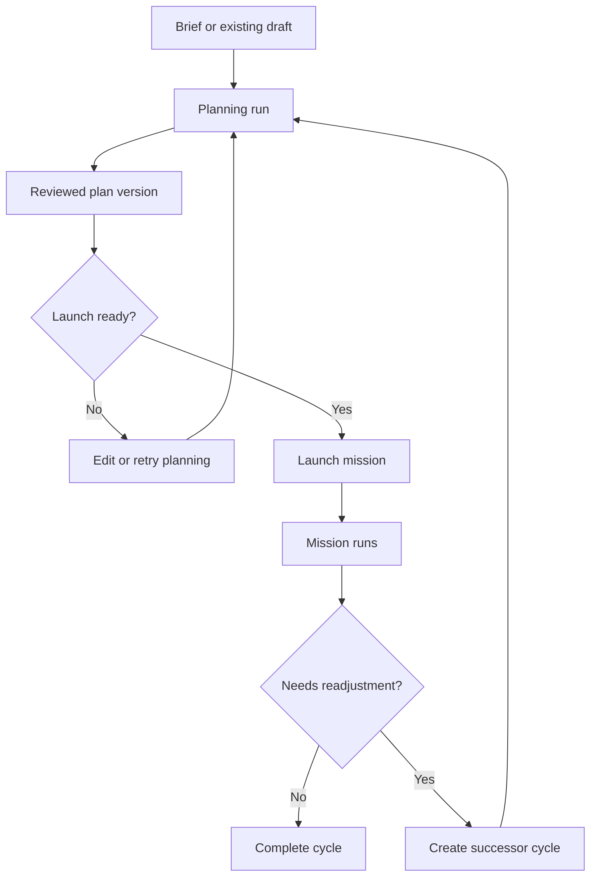

# Project Cycle Workflow

## Rules

- One cycle maps to one draft lineage.
- A launched mission stays attached to that cycle.
- Readjustment creates a linked successor cycle, not an in-place rewrite.
- Evidence follows the cycle and remains visible after successor creation.
